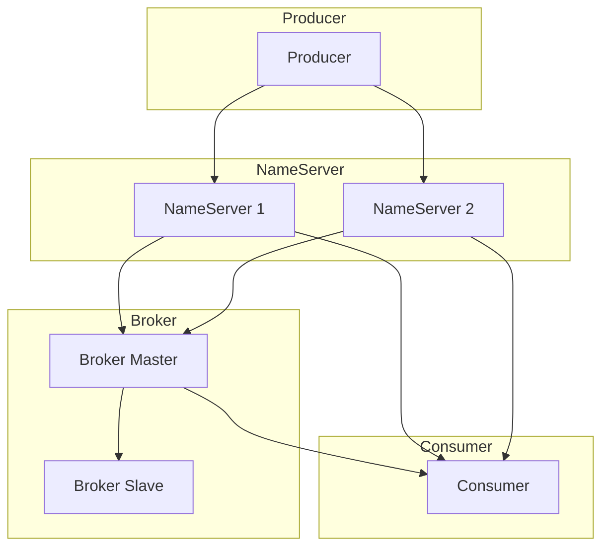
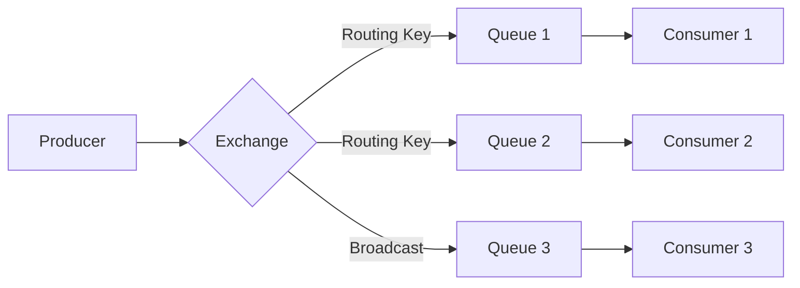
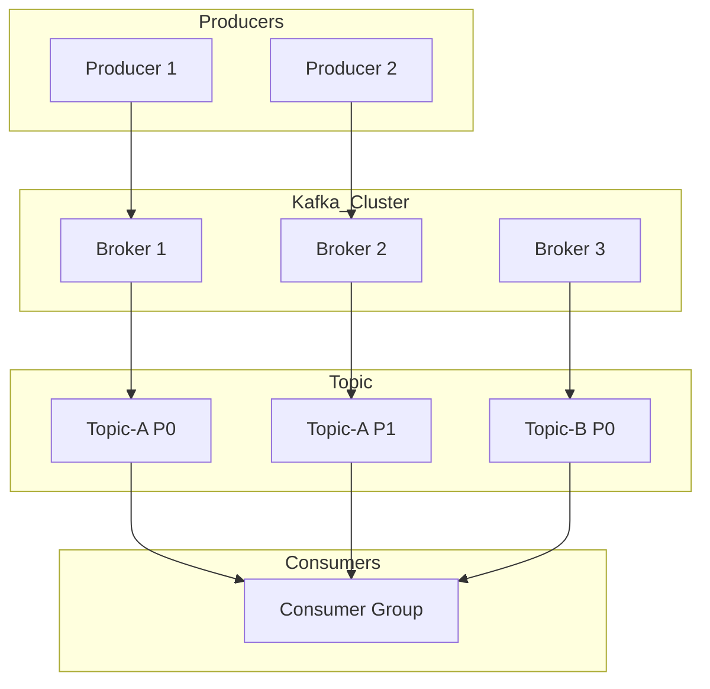

## 1 先说结论

要是你现在正纠结选哪个，直接看这里：

| 场景 | 推荐 | 一句话理由 |
|------|------|------------|
| 电商交易、订单支付 | RocketMQ | 阿里双 11 验证过，事务消息靠谱 |
| 企业内部系统 | RabbitMQ | 易用性最好，文档齐全 |
| 日志收集、用户行为 | Kafka | 吞吐量百万级，大数据标配 |
| 对延迟极其敏感 | RabbitMQ | 微秒级，三者最低 |
| 海量消息堆积 | Kafka/RocketMQ | 都能扛住亿级 |

1. **高吞吐、日志、流计算、大数据链路** → 优先 **Kafka**
2. **复杂路由、灵活队列、传统企业 / 微服务通用** → 优先 **RabbitMQ**
3. **分布式事务、电商订单、高可靠消息、大规模堆积** → 优先 **RocketMQ**

不过话说回来，2025 年之后很多公司都是混用的。比如用 RabbitMQ 处理内部业务消息，用 Kafka 做日志收集，两者不冲突。

---

## 2 消息队列是个啥

其实就是个"中间人"。

比如说你有个订单系统，用户下单后要扣库存、发短信、记日志、推物流。要是全写在一个接口里，慢不说，哪个环节挂了还可能导致整个下单失败。

这时候消息队列就派上用场了：

```
用户下单 → 发送消息到队列 → 返回成功（不等待后续处理）
           ↓
    库存服务、短信服务、日志服务、物流服务各自消费消息
```

好处很明显：<u>解耦、异步、削峰填谷</u>。

---

## 3 三大选手介绍

### 3.1 RocketMQ

阿里 2012 年开源的，后来捐给 Apache，经过双11验证过的消息队列就是这位。Java 写的，国内团队用起来比较友好。

**架构图：**



> RocketMQ 架构说明：Producer 和 Consumer 通过 NameServer 发现 Broker，Broker 主从同步保证数据不丢失。

**关键数据：**

- 吞吐量：10 万级 TPS
- 延迟：毫秒级
- 消息堆积：能扛亿级

**主打功能是这三个：**

1.  事务消息是杀手锏。比如订单创建和发消息要保证原子性，要么都成功，要么都失败。RocketMQ 用两阶段提交实现，其他两家没这个功能。
2. 延迟消息支持 18 个级别（1s、5s、10s、30m 等）。订单 30 分钟未支付自动取消，就用这个。
3. 顺序消息保证同一个订单的消息按顺序处理。比如订单创建→支付→发货，不能乱。

**适合的场景：** 电商交易（订单、支付、库存）、金融场景（转账、对账）、需要高可靠性的业务。

**要注意：** 社区生态不如 Kafka 和 RabbitMQ，遇到坑可能得自己琢磨。

---

### 3.2 RabbitMQ

2007 年就出来了，基于 Erlang 开发，稳定性没得说。

**架构图：**



> RabbitMQ 架构说明：Producer 发送消息到 Exchange，Exchange 根据 Routing Key 路由到 Queue，Consumer 从 Queue 消费。

**关键数据：**

- 吞吐量：万级 TPS
- 延迟：微秒级（三者最低）
- 路由能力：最强大

**核心特点是路由灵活：**

RabbitMQ 有 4 种 Exchange（交换机）：Direct 精确匹配点对点，Fanout 广播发给所有订阅者，Topic 通配符匹配最灵活，Headers 根据消息头匹配（用得少）。

自带 Web 控制台，队列、消息、连接一目了然，排查问题很方便。

多语言客户端，几乎所有语言都有官方客户端，接入简单。

**适合的场景：** 企业内部系统（OA、ERP、CRM）、复杂路由需求、对延迟敏感的场景、快速开发原型验证。

**要注意：** 不适合高吞吐场景，消息堆积多了会影响性能。还有 Erlang 比较小众，出了问题能帮忙的人不多。

---

### 3.3 Kafka

LinkedIn 开发，后来捐给 Apache，现在几乎是<u>日志收集</u>的代名词。

**架构图：**



> Kafka 架构说明：Producer 发送消息到 Broker，消息按 Topic 和 Partition 存储，Consumer Group 订阅 Topic 消费消息。

**几个关键数据：**
- 吞吐量：百万级 TPS（碾压级别）
- 延迟：毫秒级
- 持久化：消息可永久保存（默认 7 天）

**为什么这么快：**

**顺序写磁盘 + 零拷贝技术**，单机就能扛几十万 TPS。集群轻松百万级。

消息可以永久保存，消费者可以随时回溯历史数据。

Kafka Streams 支持实时计算，不用额外搭 Flink/Spark。

一条消息可以被多个消费者组消费，适合数据分发。

适合的场景： **日志收集（ELK 架构）**、用户行为追踪、**大数据流处理**、**数据同步（CDC）**。

**要注意：** 配置相对复杂，运维门槛高一些。而且不支持复杂的路由功能。还有 2025 年之后 KRaft 模式逐渐取代 ZooKeeper，部署简单了不少，但还是比另外两家复杂。

---

## 4 实际案例直接套用

### 4.1 电商订单流程（RocketMQ）

用户下单后要扣库存、发短信、记日志、推物流。

**生产者发送消息：**

```java
Message message = new Message("order_topic", "create", orderId.getBytes());
message.putUserProperty("userId", userId);
producer.send(message);
```

**消费者处理订单：**

```java
consumer.registerMessageListener((MessageListenerConcurrently) (msgs, context) -> {
    for (MessageExt msg : msgs) {
        String orderId = new String(msg.getBody());
        inventoryService.deduct(orderId);  // 扣库存
        smsService.send(orderId);          // 发短信
        logService.record(orderId);        // 记日志
        logisticsService.push(orderId);    // 推物流
    }
    return ConsumeConcurrentlyStatus.CONSUME_SUCCESS;
});
```

这里关键是消费者要集群部署，自动负载均衡。失败要有重试机制，确保消息不丢。

---

### 4.2 订单超时取消（RabbitMQ）

用户下单 30 分钟未支付，自动取消订单。这个用 RabbitMQ 的死信队列实现。

- **先声明延迟队列：**

```python
channel.queue_declare(queue='order.delay', arguments={
    'x-message-ttl': 1800000,  # 30 分钟
    'x-dead-letter-exchange': 'order.exchange',
    'x-dead-letter-routing-key': 'order.cancel'
})
```

- **下单后发送消息：**

```python
channel.basic_publish(
    exchange='',
    routing_key='order.delay',
    body=json.dumps({'order_id': order_id}),
    properties=pika.BasicProperties(delivery_mode=2)  # 持久化
)
```

- **监听取消队列：**

```python
def on_cancel(ch, method, properties, body):
    order = json.loads(body)
    order_service.cancel(order['order_id'])

channel.basic_consume(queue='order.cancel', on_message_callback=on_cancel)
```

原理是消息在延迟队列里待 30 分钟，过期后自动转到死信队列，消费者监听死信队列执行取消操作。

---

### 4.3 用户行为追踪（Kafka）

采集用户浏览、点击、购买行为，实时分析。

- **生产者发送行为事件：**

```java
Properties props = new Properties();
props.put("bootstrap.servers", "kafka1:9092,kafka2:9092");
props.put("key.serializer", "org.apache.kafka.common.serialization.StringSerializer");
props.put("value.serializer", "org.apache.kafka.common.serialization.StringSerializer");

KafkaProducer<String, String> producer = new KafkaProducer<>(props);

UserEvent event = new UserEvent(userId, "click", itemId, timestamp);
ProducerRecord<String, String> record = new ProducerRecord<>("user_behavior", userId, event.toJson());
producer.send(record);
```

- **消费者实时分析：**

```java
props.put("group.id", "behavior_analyzer");
KafkaConsumer<String, String> consumer = new KafkaConsumer<>(props);
consumer.subscribe(Arrays.asList("user_behavior"));

while (true) {
    ConsumerRecords<String, String> records = consumer.poll(Duration.ofMillis(100));
    for (ConsumerRecord<String, String> record : records) {
        userProfileService.update(record.value());  // 更新用户画像
    }
}
```

这里按用户 ID 分区，保证同一用户的行为有序。消费者组自动负载均衡，支持回溯历史数据。

---

## 5 常见坑与生产配置

### 5.1 消息重复消费

同一条消息被处理了多次。原因是网络抖动导致 ACK 丢失，或者消费者处理超时触发重试。

**解决方案是实现幂等性：**

```java
public class OrderConsumer implements MessageListenerConcurrently {
    @Autowired
    private RedisTemplate<String, String> redisTemplate;
    
    @Override
    public ConsumeConcurrentlyStatus consumeMessage(List<MessageExt> msgs, ConsumeConcurrentlyContext context) {
        for (MessageExt msg : msgs) {
            String msgId = msg.getMsgId();
            
            // 用 Redis 记录已处理的消息 ID
            Boolean processed = redisTemplate.opsForValue().setIfAbsent(
                "msg:processed:" + msgId, "1", 3, TimeUnit.DAYS
            );
            
            if (Boolean.FALSE.equals(processed)) {
                continue;  // 已处理过，跳过
            }
            
            orderService.process(msg);  // 处理业务
        }
        return ConsumeConcurrentlyStatus.CONSUME_SUCCESS;
    }
}
```

**记住：消费者必须实现幂等性，这是铁律！**

---

### 5.2 消息丢失

生产者发送成功，消费者没收到。原因是 Broker 宕机消息未持久化，或者同步刷盘配置不当。

**以 RocketMQ 为例：**

生产者要同步发送 + 重试：

```java
producer.setRetryTimesWhenSendFailed(3);
producer.setRetryTimesWhenSendAsyncFailed(3);

SendResult result = producer.send(message);
if (result.getSendStatus() != SendStatus.SEND_OK) {
    log.error("消息发送失败：{}", message);
}
```

Broker 配置同步刷盘 + 同步复制：

```properties
flushDiskType=SYNC_FLUSH          # 同步刷盘
brokerRole=SYNC_MASTER            # 同步复制
flushCommitLogLeastPages=1        # 至少 1 页刷盘
```

**生产环境一定要开启持久化和同步复制！**

---

### 5.3 消息堆积

消费速度跟不上生产速度，队列越积越多。

- **先排查：**

```bash
# RocketMQ 查看消费进度
mqadmin consumerProgress -n nameserver:9876 -g consumer_group

# Kafka 查看 lag
kafka-consumer-groups.sh --bootstrap-server kafka:9092 --describe --group my_group
```

- **解决办法：**

临时扩容就增加消费者实例。优化消费逻辑，异步处理、批量消费。降级处理，非核心消息丢弃或延迟处理。长期方案是拆分 Topic、增加分区。

**注意：消息堆积是告警信号，说明消费能力不足，要尽快处理！**

---

### 5.4 生产环境配置速查

**RocketMQ：**
```java
// 生产者
props.put("producerGroup", "order_producer_group");
props.put("nameserverAddr", "192.168.1.100:9876");
props.put("retryTimesWhenSendFailed", 3);

// 消费者
props.put("consumerGroup", "order_consumer_group");
props.put("consumeThreadMin", 20);
props.put("consumeThreadMax", 64);
```

**RabbitMQ：**
```python
connection = pika.BlockingConnection(pika.ConnectionParameters(
    host='192.168.1.100',
    credentials=pika.PlainCredentials('admin', 'password'),
    heartbeat=600
))
channel.queue_declare(queue='order.queue', durable=True)
```

**Kafka：**
```properties
# 生产者
acks=all
enable.idempotence=true
max.in.flight.requests.per.connection=1

# 消费者
enable.auto.commit=false
max.poll.records=100
```

---

## 5 最后总结

选型决策树：

```
需要百万级吞吐？→ 是 → Kafka
需要事务消息？→ 是 → RocketMQ
需要复杂路由？→ 是 → RabbitMQ
需要微秒级延迟？→ 是 → RabbitMQ
需要顺序消息？→ 是 → RocketMQ
需要海量堆积？→ 是 → Kafka/RocketMQ
都不需要？→ 随便选
```

---

**本文链接：** https://hyuzz-nuc.github.io/posts/message-queue-selection-guide/

**未经作者禁止转载！**
